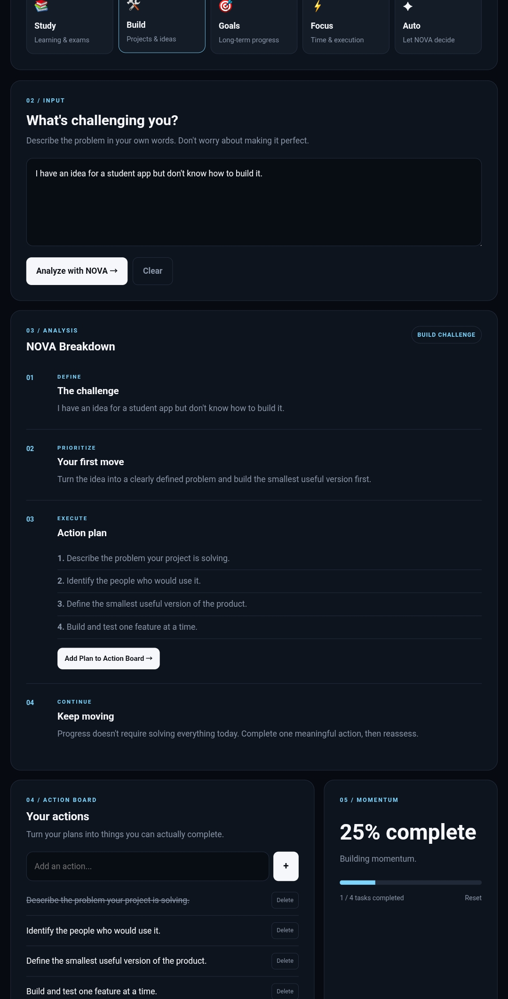

# NOVA — Student Operating System

> Think • Plan • Execute

NOVA is a student-focused productivity experiment designed to transform overwhelming problems into clear priorities, actionable steps, and measurable progress.

Instead of treating a difficult problem as one giant task, NOVA breaks it down into smaller actions that can be executed and tracked.

## 🚀 Live Demo

https://abhacks.github.io/nova-student-problem-solver/
## 📸 Preview



---

## 💡 The Problem

When students face a difficult problem, the hardest part is often not the work itself.

It's knowing where to start.

An exam can feel overwhelming.

A programming project can feel impossible.

A career goal can feel too distant.

NOVA was built around a simple idea:

> Turn uncertainty into structure, and structure into action.

---

## 🧠 How NOVA Works

NOVA follows a simple problem-solving pipeline:

```text
INPUT
  ↓
CLASSIFY
  ↓
BREAK DOWN
  ↓
ACTION BOARD
  ↓
TRACK PROGRESS
